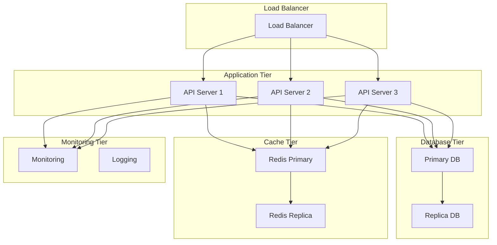

# Environment Setup - Virtual Queue Management System

**Document Version:** 1.0  
**Date:** January 15, 2024  
**Author:** DevOps Engineer  
**Status:** Draft  
**Phase:** 09 - Deployment  
**Priority:** 🔴 Critical  

---

## Environment Setup Overview

This document provides comprehensive instructions for setting up the Virtual Queue Management System across different environments. It covers development, testing, staging, and production environment configurations, including infrastructure setup, software installation, and configuration management.

## Environment Architecture

### **Environment Tiers**

| Environment | Purpose | Users | Data | Availability |
|-------------|---------|-------|------|--------------|
| **Development** | Development and testing | Developers | Synthetic | 8x5 |
| **Testing** | QA testing and validation | QA Team | Synthetic | 8x5 |
| **Staging** | Pre-production validation | Stakeholders | Production-like | 24x7 |
| **Production** | Live system operation | End Users | Production | 24x7 |

### **Infrastructure Components**



## System Requirements

### **Hardware Requirements**

#### **Development Environment**
- **CPU**: 4 cores, 2.4 GHz
- **RAM**: 8 GB
- **Storage**: 100 GB SSD
- **Network**: 100 Mbps

#### **Testing Environment**
- **CPU**: 8 cores, 2.4 GHz
- **RAM**: 16 GB
- **Storage**: 200 GB SSD
- **Network**: 1 Gbps

#### **Staging Environment**
- **CPU**: 16 cores, 2.8 GHz
- **RAM**: 32 GB
- **Storage**: 500 GB SSD
- **Network**: 10 Gbps

#### **Production Environment**
- **CPU**: 32 cores, 3.0 GHz
- **RAM**: 64 GB
- **Storage**: 1 TB SSD
- **Network**: 10 Gbps

### **Software Requirements**

#### **Operating System**
- **Linux**: Ubuntu 20.04 LTS or CentOS 8
- **Windows**: Windows Server 2019 or later
- **Docker**: Docker 20.10+ with Docker Compose

#### **Runtime Requirements**
- **.NET 8**: .NET 8.0 Runtime
- **Node.js**: Node.js 18+ (for frontend)
- **Python**: Python 3.9+ (for scripts)

#### **Database Requirements**
- **PostgreSQL**: PostgreSQL 15+
- **Redis**: Redis 7.0+

#### **Web Server Requirements**
- **Nginx**: Nginx 1.20+ (reverse proxy)
- **IIS**: IIS 10+ (Windows)

## Development Environment Setup

### **Local Development Setup**

#### **Prerequisites Installation**
```bash
# Install .NET 8 SDK
wget https://packages.microsoft.com/config/ubuntu/20.04/packages-microsoft-prod.deb
sudo dpkg -i packages-microsoft-prod.deb
sudo apt-get update
sudo apt-get install -y dotnet-sdk-8.0

# Install Node.js
curl -fsSL https://deb.nodesource.com/setup_18.x | sudo -E bash -
sudo apt-get install -y nodejs

# Install Docker
sudo apt-get update
sudo apt-get install -y docker.io docker-compose
sudo systemctl start docker
sudo systemctl enable docker
sudo usermod -aG docker $USER
```

#### **Project Setup**
```bash
# Clone repository
git clone https://github.com/your-org/virtual-queue-system.git
cd virtual-queue-system

# Restore dependencies
dotnet restore

# Build solution
dotnet build

# Run tests
dotnet test

# Start development environment
docker-compose -f docker-compose.dev.yml up -d
```

#### **Development Configuration**
```json
{
  "ConnectionStrings": {
    "DefaultConnection": "Host=localhost;Database=VirtualQueueDev;Username=postgres;Password=devpassword"
  },
  "Redis": {
    "ConnectionString": "localhost:6379"
  },
  "Logging": {
    "LogLevel": {
      "Default": "Debug",
      "Microsoft": "Information",
      "Microsoft.Hosting.Lifetime": "Information"
    }
  },
  "AllowedHosts": "*",
  "Cors": {
    "AllowedOrigins": ["http://localhost:3000", "http://localhost:4200"]
  }
}
```

### **Docker Development Environment**

#### **Docker Compose Configuration**
```yaml
version: '3.8'

services:
  api:
    build:
      context: .
      dockerfile: Dockerfile
    ports:
      - "5000:80"
    environment:
      - ASPNETCORE_ENVIRONMENT=Development
      - ConnectionStrings__DefaultConnection=Host=db;Database=VirtualQueueDev;Username=postgres;Password=devpassword
      - Redis__ConnectionString=redis:6379
    depends_on:
      - db
      - redis
    volumes:
      - .:/app
      - /app/bin
      - /app/obj

  db:
    image: postgres:15
    environment:
      - POSTGRES_DB=VirtualQueueDev
      - POSTGRES_USER=postgres
      - POSTGRES_PASSWORD=devpassword
    ports:
      - "5432:5432"
    volumes:
      - postgres_data:/var/lib/postgresql/data

  redis:
    image: redis:7-alpine
    ports:
      - "6379:6379"
    volumes:
      - redis_data:/data

  frontend:
    build:
      context: ./src/VirtualQueue.Web
      dockerfile: Dockerfile
    ports:
      - "3000:80"
    environment:
      - REACT_APP_API_URL=http://localhost:5000
    depends_on:
      - api

volumes:
  postgres_data:
  redis_data:
```

#### **Development Scripts**
```bash
#!/bin/bash
# dev-setup.sh

echo "Setting up development environment..."

# Start services
docker-compose -f docker-compose.dev.yml up -d

# Wait for services to be ready
echo "Waiting for services to start..."
sleep 30

# Run database migrations
dotnet ef database update --project src/VirtualQueue.Infrastructure --startup-project src/VirtualQueue.Api

# Seed development data
dotnet run --project src/VirtualQueue.Api --seed-data

echo "Development environment ready!"
echo "API: http://localhost:5000"
echo "Frontend: http://localhost:3000"
echo "Database: localhost:5432"
echo "Redis: localhost:6379"
```

## Testing Environment Setup

### **Testing Infrastructure**

#### **Test Environment Configuration**
```yaml
# docker-compose.test.yml
version: '3.8'

services:
  api-test:
    build:
      context: .
      dockerfile: Dockerfile
    environment:
      - ASPNETCORE_ENVIRONMENT=Testing
      - ConnectionStrings__DefaultConnection=Host=db-test;Database=VirtualQueueTest;Username=postgres;Password=testpassword
      - Redis__ConnectionString=redis-test:6379
    depends_on:
      - db-test
      - redis-test

  db-test:
    image: postgres:15
    environment:
      - POSTGRES_DB=VirtualQueueTest
      - POSTGRES_USER=postgres
      - POSTGRES_PASSWORD=testpassword
    ports:
      - "5433:5432"
    volumes:
      - postgres_test_data:/var/lib/postgresql/data

  redis-test:
    image: redis:7-alpine
    ports:
      - "6380:6379"
    volumes:
      - redis_test_data:/data

volumes:
  postgres_test_data:
  redis_test_data:
```

#### **Test Data Setup**
```bash
#!/bin/bash
# test-setup.sh

echo "Setting up testing environment..."

# Start test services
docker-compose -f docker-compose.test.yml up -d

# Wait for services
sleep 30

# Run migrations
dotnet ef database update --project src/VirtualQueue.Infrastructure --startup-project src/VirtualQueue.Api --environment Testing

# Seed test data
dotnet run --project src/VirtualQueue.Api --environment Testing --seed-test-data

# Run tests
dotnet test --environment Testing

echo "Testing environment ready!"
```

### **Test Data Management**

#### **Test Data Seeding**
```csharp
public class TestDataSeeder
{
    private readonly VirtualQueueDbContext _context;

    public TestDataSeeder(VirtualQueueDbContext context)
    {
        _context = context;
    }

    public async Task SeedAsync()
    {
        if (!_context.Tenants.Any())
        {
            var tenants = new[]
            {
                new Tenant { Id = Guid.NewGuid(), Name = "Test Tenant 1", Slug = "test-tenant-1" },
                new Tenant { Id = Guid.NewGuid(), Name = "Test Tenant 2", Slug = "test-tenant-2" }
            };

            _context.Tenants.AddRange(tenants);
            await _context.SaveChangesAsync();
        }

        if (!_context.Queues.Any())
        {
            var queues = new[]
            {
                new Queue { Id = Guid.NewGuid(), Name = "Test Queue 1", Capacity = 100, TenantId = _context.Tenants.First().Id },
                new Queue { Id = Guid.NewGuid(), Name = "Test Queue 2", Capacity = 200, TenantId = _context.Tenants.First().Id }
            };

            _context.Queues.AddRange(queues);
            await _context.SaveChangesAsync();
        }
    }
}
```

## Staging Environment Setup

### **Staging Infrastructure**

#### **Staging Configuration**
```yaml
# docker-compose.staging.yml
version: '3.8'

services:
  api-staging:
    build:
      context: .
      dockerfile: Dockerfile
    environment:
      - ASPNETCORE_ENVIRONMENT=Staging
      - ConnectionStrings__DefaultConnection=${STAGING_DB_CONNECTION}
      - Redis__ConnectionString=${STAGING_REDIS_CONNECTION}
    deploy:
      replicas: 2
    depends_on:
      - db-staging
      - redis-staging

  db-staging:
    image: postgres:15
    environment:
      - POSTGRES_DB=${STAGING_DB_NAME}
      - POSTGRES_USER=${STAGING_DB_USER}
      - POSTGRES_PASSWORD=${STAGING_DB_PASSWORD}
    volumes:
      - postgres_staging_data:/var/lib/postgresql/data
    deploy:
      resources:
        limits:
          memory: 4G
        reservations:
          memory: 2G

  redis-staging:
    image: redis:7-alpine
    volumes:
      - redis_staging_data:/data
    deploy:
      resources:
        limits:
          memory: 2G
        reservations:
          memory: 1G

volumes:
  postgres_staging_data:
  redis_staging_data:
```

#### **Staging Deployment Script**
```bash
#!/bin/bash
# staging-deploy.sh

echo "Deploying to staging environment..."

# Set environment variables
export STAGING_DB_CONNECTION="Host=staging-db;Database=VirtualQueueStaging;Username=staging_user;Password=staging_password"
export STAGING_REDIS_CONNECTION="staging-redis:6379"

# Build and deploy
docker-compose -f docker-compose.staging.yml build
docker-compose -f docker-compose.staging.yml up -d

# Wait for services
sleep 60

# Run migrations
dotnet ef database update --project src/VirtualQueue.Infrastructure --startup-project src/VirtualQueue.Api --environment Staging

# Health check
curl -f http://staging-api:80/health || exit 1

echo "Staging deployment complete!"
```

## Production Environment Setup

### **Production Infrastructure**

#### **Production Configuration**
```yaml
# docker-compose.prod.yml
version: '3.8'

services:
  api-prod:
    build:
      context: .
      dockerfile: Dockerfile
    environment:
      - ASPNETCORE_ENVIRONMENT=Production
      - ConnectionStrings__DefaultConnection=${PROD_DB_CONNECTION}
      - Redis__ConnectionString=${PROD_REDIS_CONNECTION}
    deploy:
      replicas: 3
      resources:
        limits:
          memory: 2G
          cpus: '1.0'
        reservations:
          memory: 1G
          cpus: '0.5'
    depends_on:
      - db-prod
      - redis-prod

  db-prod:
    image: postgres:15
    environment:
      - POSTGRES_DB=${PROD_DB_NAME}
      - POSTGRES_USER=${PROD_DB_USER}
      - POSTGRES_PASSWORD=${PROD_DB_PASSWORD}
    volumes:
      - postgres_prod_data:/var/lib/postgresql/data
    deploy:
      resources:
        limits:
          memory: 8G
          cpus: '4.0'
        reservations:
          memory: 4G
          cpus: '2.0'

  redis-prod:
    image: redis:7-alpine
    volumes:
      - redis_prod_data:/data
    deploy:
      resources:
        limits:
          memory: 4G
          cpus: '2.0'
        reservations:
          memory: 2G
          cpus: '1.0'

volumes:
  postgres_prod_data:
  redis_prod_data:
```

### **Production Deployment**

#### **Production Deployment Script**
```bash
#!/bin/bash
# prod-deploy.sh

set -e

echo "Starting production deployment..."

# Validate environment variables
if [ -z "$PROD_DB_CONNECTION" ]; then
    echo "Error: PROD_DB_CONNECTION not set"
    exit 1
fi

if [ -z "$PROD_REDIS_CONNECTION" ]; then
    echo "Error: PROD_REDIS_CONNECTION not set"
    exit 1
fi

# Backup current deployment
echo "Creating backup..."
docker-compose -f docker-compose.prod.yml exec db-prod pg_dump -U ${PROD_DB_USER} ${PROD_DB_NAME} > backup_$(date +%Y%m%d_%H%M%S).sql

# Build new images
echo "Building new images..."
docker-compose -f docker-compose.prod.yml build

# Deploy with zero downtime
echo "Deploying with zero downtime..."
docker-compose -f docker-compose.prod.yml up -d --no-deps api-prod

# Wait for new instances to be healthy
echo "Waiting for new instances to be healthy..."
sleep 30

# Health check
echo "Performing health check..."
curl -f http://localhost:80/health || {
    echo "Health check failed, rolling back..."
    docker-compose -f docker-compose.prod.yml rollback
    exit 1
}

# Run migrations
echo "Running database migrations..."
dotnet ef database update --project src/VirtualQueue.Infrastructure --startup-project src/VirtualQueue.Api --environment Production

# Cleanup old images
echo "Cleaning up old images..."
docker image prune -f

echo "Production deployment complete!"
```

## Configuration Management

### **Environment Variables**

#### **Required Environment Variables**
```bash
# Database Configuration
DB_HOST=localhost
DB_PORT=5432
DB_NAME=VirtualQueue
DB_USER=postgres
DB_PASSWORD=your_password

# Redis Configuration
REDIS_HOST=localhost
REDIS_PORT=6379
REDIS_PASSWORD=your_redis_password

# Application Configuration
ASPNETCORE_ENVIRONMENT=Production
ASPNETCORE_URLS=http://+:80

# Security Configuration
JWT_SECRET=your_jwt_secret
JWT_ISSUER=VirtualQueue
JWT_AUDIENCE=VirtualQueueUsers

# External Services
EMAIL_SERVICE_URL=https://api.emailservice.com
SMS_SERVICE_URL=https://api.smsservice.com
WEBHOOK_SECRET=your_webhook_secret

# Monitoring
PROMETHEUS_ENDPOINT=http://localhost:9090
GRAFANA_ENDPOINT=http://localhost:3000
```

#### **Configuration Files**
```json
{
  "ConnectionStrings": {
    "DefaultConnection": "Host=${DB_HOST};Port=${DB_PORT};Database=${DB_NAME};Username=${DB_USER};Password=${DB_PASSWORD}"
  },
  "Redis": {
    "ConnectionString": "${REDIS_HOST}:${REDIS_PORT}",
    "Password": "${REDIS_PASSWORD}"
  },
  "Jwt": {
    "Secret": "${JWT_SECRET}",
    "Issuer": "${JWT_ISSUER}",
    "Audience": "${JWT_AUDIENCE}",
    "ExpiryMinutes": 60
  },
  "ExternalServices": {
    "EmailService": {
      "Url": "${EMAIL_SERVICE_URL}",
      "ApiKey": "${EMAIL_API_KEY}"
    },
    "SmsService": {
      "Url": "${SMS_SERVICE_URL}",
      "ApiKey": "${SMS_API_KEY}"
    }
  },
  "Monitoring": {
    "Prometheus": {
      "Endpoint": "${PROMETHEUS_ENDPOINT}"
    },
    "Grafana": {
      "Endpoint": "${GRAFANA_ENDPOINT}"
    }
  }
}
```

### **Secrets Management**

#### **Docker Secrets**
```yaml
# docker-compose.secrets.yml
version: '3.8'

services:
  api:
    image: virtualqueue-api:latest
    secrets:
      - db_password
      - redis_password
      - jwt_secret
    environment:
      - ConnectionStrings__DefaultConnection=Host=db;Database=VirtualQueue;Username=postgres;Password_FILE=/run/secrets/db_password
      - Redis__Password_FILE=/run/secrets/redis_password
      - Jwt__Secret_FILE=/run/secrets/jwt_secret

secrets:
  db_password:
    external: true
  redis_password:
    external: true
  jwt_secret:
    external: true
```

#### **Kubernetes Secrets**
```yaml
apiVersion: v1
kind: Secret
metadata:
  name: virtualqueue-secrets
type: Opaque
data:
  db-password: <base64-encoded-password>
  redis-password: <base64-encoded-password>
  jwt-secret: <base64-encoded-secret>
```

## Monitoring and Logging

### **Monitoring Setup**

#### **Prometheus Configuration**
```yaml
# prometheus.yml
global:
  scrape_interval: 15s

scrape_configs:
  - job_name: 'virtualqueue-api'
    static_configs:
      - targets: ['api:80']
    metrics_path: '/metrics'
    scrape_interval: 5s

  - job_name: 'postgres'
    static_configs:
      - targets: ['postgres-exporter:9187']

  - job_name: 'redis'
    static_configs:
      - targets: ['redis-exporter:9121']
```

#### **Grafana Dashboard**
```json
{
  "dashboard": {
    "title": "Virtual Queue System",
    "panels": [
      {
        "title": "API Request Rate",
        "type": "graph",
        "targets": [
          {
            "expr": "rate(http_requests_total[5m])",
            "legendFormat": "{{method}} {{endpoint}}"
          }
        ]
      },
      {
        "title": "Response Time",
        "type": "graph",
        "targets": [
          {
            "expr": "histogram_quantile(0.95, rate(http_request_duration_seconds_bucket[5m]))",
            "legendFormat": "95th percentile"
          }
        ]
      }
    ]
  }
}
```

### **Logging Configuration**

#### **Serilog Configuration**
```json
{
  "Serilog": {
    "Using": ["Serilog.Sinks.Console", "Serilog.Sinks.File", "Serilog.Sinks.Elasticsearch"],
    "MinimumLevel": {
      "Default": "Information",
      "Override": {
        "Microsoft": "Warning",
        "System": "Warning"
      }
    },
    "WriteTo": [
      {
        "Name": "Console",
        "Args": {
          "outputTemplate": "{Timestamp:yyyy-MM-dd HH:mm:ss.fff zzz} [{Level:u3}] {Message:lj}{NewLine}{Exception}"
        }
      },
      {
        "Name": "File",
        "Args": {
          "path": "/var/log/virtualqueue/app-.log",
          "rollingInterval": "Day",
          "retainedFileCountLimit": 30
        }
      },
      {
        "Name": "Elasticsearch",
        "Args": {
          "nodeUris": "http://elasticsearch:9200",
          "indexFormat": "virtualqueue-{0:yyyy.MM.dd}"
        }
      }
    ]
  }
}
```

## Security Configuration

### **Security Headers**

#### **Nginx Security Configuration**
```nginx
server {
    listen 80;
    server_name api.virtualqueue.com;

    # Security headers
    add_header X-Frame-Options "SAMEORIGIN" always;
    add_header X-Content-Type-Options "nosniff" always;
    add_header X-XSS-Protection "1; mode=block" always;
    add_header Strict-Transport-Security "max-age=31536000; includeSubDomains" always;
    add_header Content-Security-Policy "default-src 'self'; script-src 'self' 'unsafe-inline'; style-src 'self' 'unsafe-inline';" always;

    # Rate limiting
    limit_req_zone $binary_remote_addr zone=api:10m rate=10r/s;
    limit_req zone=api burst=20 nodelay;

    location / {
        proxy_pass http://api;
        proxy_set_header Host $host;
        proxy_set_header X-Real-IP $remote_addr;
        proxy_set_header X-Forwarded-For $proxy_add_x_forwarded_for;
        proxy_set_header X-Forwarded-Proto $scheme;
    }
}
```

### **SSL/TLS Configuration**

#### **SSL Certificate Setup**
```bash
# Generate SSL certificate
openssl req -x509 -nodes -days 365 -newkey rsa:2048 \
  -keyout /etc/ssl/private/virtualqueue.key \
  -out /etc/ssl/certs/virtualqueue.crt \
  -subj "/C=US/ST=State/L=City/O=Organization/CN=api.virtualqueue.com"

# Configure Nginx with SSL
server {
    listen 443 ssl http2;
    server_name api.virtualqueue.com;

    ssl_certificate /etc/ssl/certs/virtualqueue.crt;
    ssl_certificate_key /etc/ssl/private/virtualqueue.key;
    ssl_protocols TLSv1.2 TLSv1.3;
    ssl_ciphers ECDHE-RSA-AES256-GCM-SHA512:DHE-RSA-AES256-GCM-SHA512:ECDHE-RSA-AES256-GCM-SHA384:DHE-RSA-AES256-GCM-SHA384;
    ssl_prefer_server_ciphers off;
    ssl_session_cache shared:SSL:10m;
    ssl_session_timeout 10m;

    location / {
        proxy_pass http://api;
        proxy_set_header Host $host;
        proxy_set_header X-Real-IP $remote_addr;
        proxy_set_header X-Forwarded-For $proxy_add_x_forwarded_for;
        proxy_set_header X-Forwarded-Proto $scheme;
    }
}
```

## Backup and Recovery

### **Database Backup**

#### **Automated Backup Script**
```bash
#!/bin/bash
# backup.sh

BACKUP_DIR="/var/backups/virtualqueue"
DATE=$(date +%Y%m%d_%H%M%S)
DB_NAME="VirtualQueue"

# Create backup directory
mkdir -p $BACKUP_DIR

# Create database backup
pg_dump -h $DB_HOST -U $DB_USER -d $DB_NAME > $BACKUP_DIR/db_backup_$DATE.sql

# Compress backup
gzip $BACKUP_DIR/db_backup_$DATE.sql

# Keep only last 30 days of backups
find $BACKUP_DIR -name "db_backup_*.sql.gz" -mtime +30 -delete

echo "Backup completed: db_backup_$DATE.sql.gz"
```

#### **Backup Restoration**
```bash
#!/bin/bash
# restore.sh

BACKUP_FILE=$1

if [ -z "$BACKUP_FILE" ]; then
    echo "Usage: $0 <backup_file>"
    exit 1
fi

# Restore database
gunzip -c $BACKUP_FILE | psql -h $DB_HOST -U $DB_USER -d $DB_NAME

echo "Database restored from $BACKUP_FILE"
```

### **Redis Backup**

#### **Redis Backup Script**
```bash
#!/bin/bash
# redis-backup.sh

BACKUP_DIR="/var/backups/redis"
DATE=$(date +%Y%m%d_%H%M%S)

# Create backup directory
mkdir -p $BACKUP_DIR

# Create Redis backup
redis-cli --rdb $BACKUP_DIR/redis_backup_$DATE.rdb

# Compress backup
gzip $BACKUP_DIR/redis_backup_$DATE.rdb

# Keep only last 7 days of backups
find $BACKUP_DIR -name "redis_backup_*.rdb.gz" -mtime +7 -delete

echo "Redis backup completed: redis_backup_$DATE.rdb.gz"
```

## Troubleshooting

### **Common Issues**

#### **Database Connection Issues**
```bash
# Check database connectivity
pg_isready -h $DB_HOST -p $DB_PORT -U $DB_USER

# Check database status
docker-compose exec db psql -U postgres -c "SELECT version();"

# Reset database
docker-compose exec db psql -U postgres -c "DROP DATABASE IF EXISTS VirtualQueue;"
docker-compose exec db psql -U postgres -c "CREATE DATABASE VirtualQueue;"
```

#### **Redis Connection Issues**
```bash
# Check Redis connectivity
redis-cli -h $REDIS_HOST -p $REDIS_PORT ping

# Check Redis status
docker-compose exec redis redis-cli info

# Clear Redis cache
docker-compose exec redis redis-cli flushall
```

#### **Application Issues**
```bash
# Check application logs
docker-compose logs api

# Check application health
curl -f http://localhost:80/health

# Restart application
docker-compose restart api
```

### **Performance Issues**

#### **Database Performance**
```sql
-- Check slow queries
SELECT query, mean_time, calls, total_time
FROM pg_stat_statements
ORDER BY mean_time DESC
LIMIT 10;

-- Check database size
SELECT pg_size_pretty(pg_database_size('VirtualQueue'));

-- Check table sizes
SELECT schemaname, tablename, pg_size_pretty(pg_total_relation_size(schemaname||'.'||tablename)) as size
FROM pg_tables
ORDER BY pg_total_relation_size(schemaname||'.'||tablename) DESC;
```

#### **Redis Performance**
```bash
# Check Redis memory usage
redis-cli info memory

# Check Redis performance
redis-cli --latency-history

# Monitor Redis commands
redis-cli monitor
```

## Approval and Sign-off

### **Environment Setup Approval**
- **DevOps Engineer**: [Name] - [Date]
- **Technical Lead**: [Name] - [Date]
- **Security Lead**: [Name] - [Date]
- **Infrastructure Lead**: [Name] - [Date]

### **Document Control**
- **Version**: 1.0
- **Last Updated**: January 15, 2024
- **Next Review**: February 15, 2024
- **Distribution**: Development Team, DevOps Team, Operations Team

---

**Document Status**: Draft  
**Next Phase**: Rollback Procedures  
**Dependencies**: Environment validation, security review, performance testing
